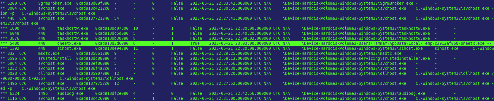
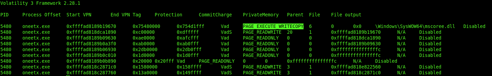
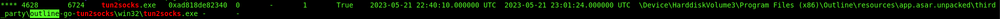
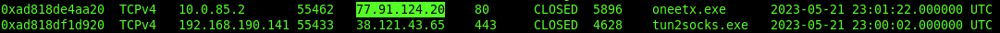

# Incident Response Report

## RedLine Memory Forensics — Malware Execution & Memory Analysis

---

| Field              | Details          |
| ------------------ | ---------------- |
| **Severity**       | High             |
| **Status**         | Closed           |
| **Analyst**        | Murillo H. W. G. |
| **Date**           | 2026-06-26       |
| **Platform**       | CyberDefenders   |
| **Classification** | TLP:WHITE        |

---

# Table of Contents

1. Executive Summary
2. Scope & Methodology
3. Attack Timeline
4. Technical Findings
5. Indicators of Compromise (IOCs)
6. Impact Assessment
7. Appendix
8. Concepts & Recommendations

---

# 1. Executive Summary

A Windows memory dump was analyzed following a malware infection involving the RedLine Stealer. The investigation focused on identifying the malicious process, analyzing its memory regions, correlating parent/child processes, identifying network activity, and collecting Indicators of Compromise (IOCs).

The analysis confirmed malware execution within the compromised host and revealed evidence of attacker infrastructure communication through an external IP address.

> **Risk Level: HIGH** — Malware execution with external communication was confirmed through memory forensics.

---

# 2. Scope & Methodology

## Scope

| Item             | Value                           |
| ---------------- | ------------------------------- |
| Evidence File    | MemoryDump.mem                  |
| Analysis Tool(s) | Volatility 3, Linux CLI         |
| Target           | Windows Workstation Memory Dump |
| Analysis Type    | Post-Incident Memory Forensics  |

## Methodology

1. Loaded the Windows memory image using Volatility 3.
2. Enumerated active processes using `windows.pslist`.
3. Correlated parent-child relationships using `windows.pstree`.
4. Investigated memory mappings using `windows.vadinfo`.
5. Identified network connections using `windows.netscan`.
6. Collected Indicators of Compromise (IOCs).
7. Correlated findings to reconstruct attacker activity.

---

# 3. Attack Timeline

```text
Initial Malware Execution
    └── Suspicious process (oneetx.exe) identified

Process Correlation
    └── Parent-child relationship with Outline VPN components established

Memory Analysis
    └── Suspicious executable memory regions identified

Network Activity
    └── Outbound connection established to attacker-controlled infrastructure

Malware Discovery
    └── PHP resource accessed and malware execution path identified
```

---

# 4. Technical Findings

## 4.1 Suspicious Process Identification

A review of active processes identified **oneetx.exe**, an uncommon executable whose name closely resembles legitimate Windows applications. The process was selected for further investigation due to its suspicious naming convention and execution context.

| Field   | Value      |
| ------- | ---------- |
| Process | oneetx.exe |
| PID     | 5480       |

**Evidence**

> `Q1-suspicious-process.png` — Identification of the suspicious process during process enumeration.



---

## 4.2 Parent-Child Process Relationship

Process tree analysis showed that **oneetx.exe** was associated with the Outline VPN application, allowing correlation between related processes during the investigation.

| Field          | Value         |
| -------------- | ------------- |
| Parent Process | outline.exe   |
| Child Process  | tun2socks.exe |

**Evidence**

> `Q2-suspicious-process-child.png` — Parent-child relationship identified using the process tree.


---

## 4.3 Memory Protection Analysis

Virtual Address Descriptor (VAD) analysis was performed to inspect memory protection attributes associated with the suspicious process. Executable memory permissions indicated a potentially injected or malicious memory region.

| Field             | Value                  |
| ----------------- | ---------------------- |
| Memory Protection | PAGE_EXECUTE_WRITECOPY |

**Evidence**

> `Q3-memory-protection-applied.png` — Memory protection associated with the suspicious region.



---

## 4.4 VPN Component Identification

The investigation confirmed that the malicious activity involved components related to Outline VPN, specifically the **outline.exe** process.

| Field           | Value       |
| --------------- | ----------- |
| Application     | Outline VPN |
| Related Process | outline.exe |

**Evidence**

> `Q4-outline.exe-VPN-process-.png` — Outline VPN process identified during memory analysis.



---

## 4.5 Attacker Infrastructure

Network artifact analysis identified outbound communication between the compromised host and an external IP address associated with attacker-controlled infrastructure.

| Field       | Value           |
| ----------- | --------------- |
| Attacker IP | `<77.91.124.20>` |

**Evidence**

> `Q5-attacker-ip-address.png` — External network connection identified using Volatility.



---

## 4.6 PHP Resource Access

Investigation of network artifacts revealed the complete PHP resource requested during attacker activity.

| Field        | Value             |
| ------------ | ----------------- |
| PHP Resource | `<http://77.91.124.20/store/games/index.php>` |

**Evidence**

> `Q6-attacker-php-url.png` — Full PHP path accessed during the attack.


---

## 4.7 Malware Location

The full execution path of the malware was recovered from memory artifacts.

| Field        | Value                 |
| ------------ | --------------------- |
| Malware Path | `<C:\Users\Tammam\AppData\Local\Temp\c3912af058\oneetx.exe>` |

**Evidence**

> `Q7-full-malware-path.png` — Full malware path identified during forensic analysis.


---

# 5. Indicators of Compromise (IOCs)

| Type       | Value                 | Context                |
| ---------- | --------------------- | ---------------------- |
| Process    | oneetx.exe            | Suspicious executable  |
| Process    | outline.exe           | Parent process         |
| Process    | tun2socks.exe         | VPN tunnel process     |
| IP Address | `<ATTACKER_IP>`       | External communication |
| URL        | `<FULL_PHP_PATH>`     | PHP resource accessed  |
| File Path  | `<FULL_MALWARE_PATH>` | Malware location       |

---

# 6. Impact Assessment

| Impact Area            | Severity | Description                                             |
| ---------------------- | -------- | ------------------------------------------------------- |
| Malware Execution      | High     | Malicious process successfully executed.                |
| External Communication | High     | Communication established with external infrastructure. |
| Host Compromise        | High     | Malware execution confirmed within memory.              |

---

# 7. Appendix

## 7.1 Tools Used

* Volatility 3
* Linux Command Line
* grep
* strings

**Usage Context**

Used throughout the investigation to enumerate processes, inspect memory regions, identify network connections, and collect Indicators of Compromise.

---

# 8. Concepts & Recommendations

## Vulnerability Root Causes

| Root Cause                      | Related Finding |
| ------------------------------- | --------------- |
| Malicious executable execution  | 4.1             |
| External attacker communication | 4.5             |
| Malware persistence in memory   | 4.3             |

## Remediation Recommendations

### 1. Endpoint Protection — Immediate

* Isolate the compromised host.
* Remove the malicious executable.
* Acquire additional forensic evidence before remediation.

### 2. Network Security — Short-term

* Block attacker infrastructure.
* Review firewall and proxy logs.
* Monitor outbound traffic for additional indicators.

### 3. Detection Engineering — Long-term

* Develop detection rules for suspicious process names.
* Monitor executable memory regions with RWX permissions.
* Continuously monitor unusual parent-child process relationships.

---

*Report generated as part of a DFIR / Memory Forensics laboratory.*

*Analysis performed in a controlled environment for educational purposes.*
