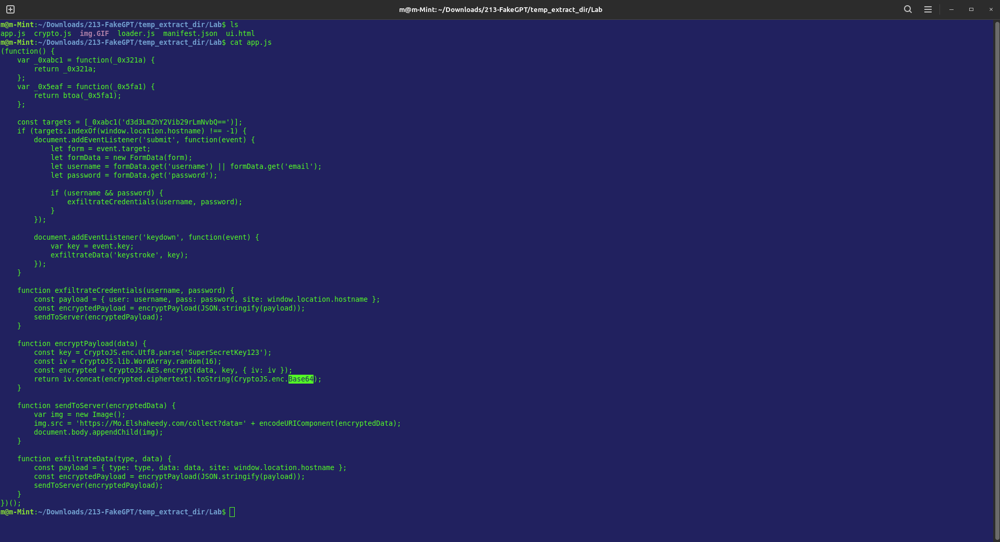
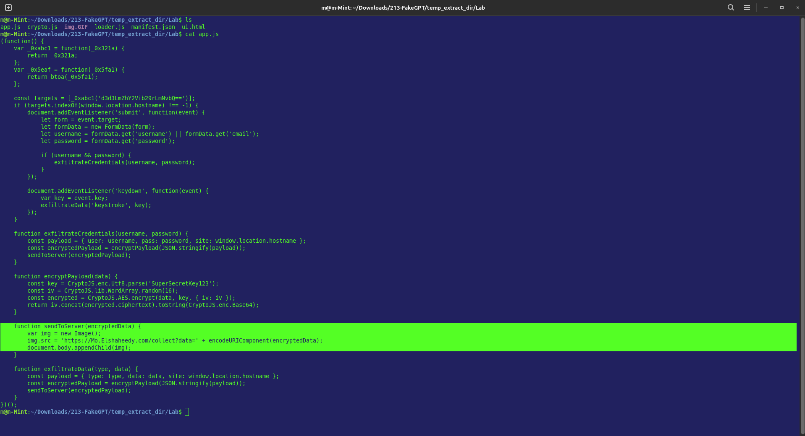
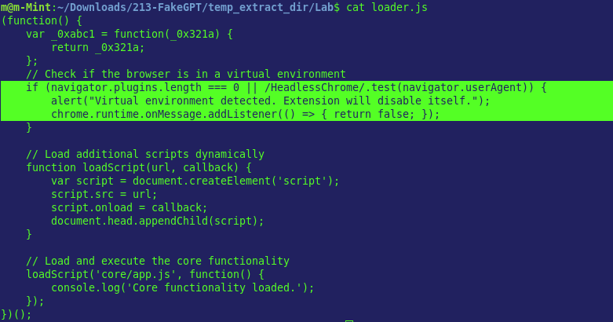
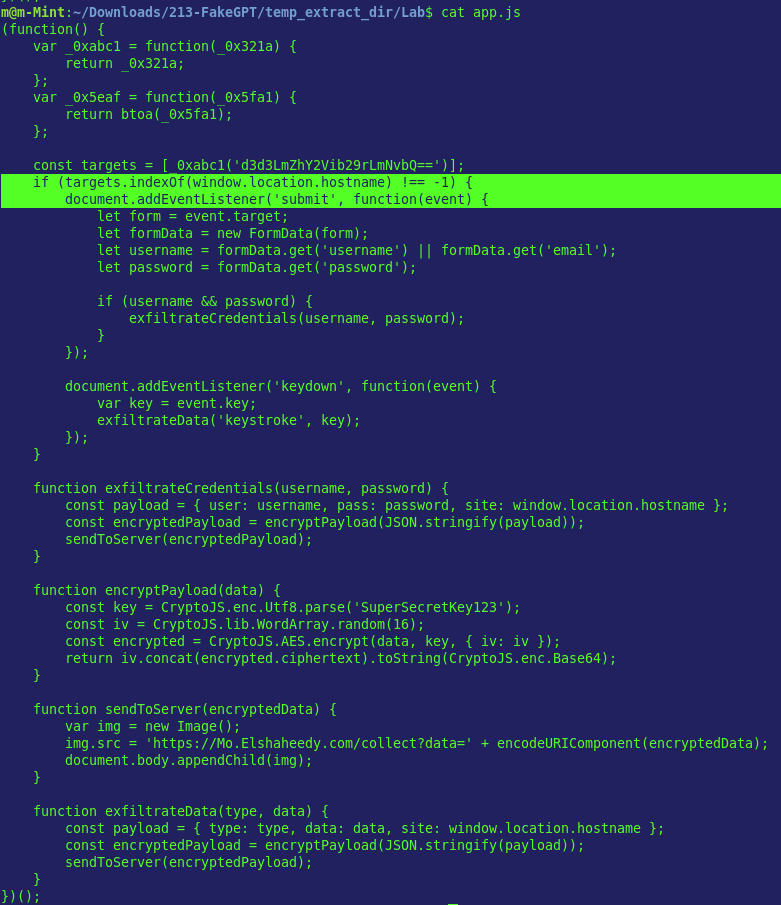
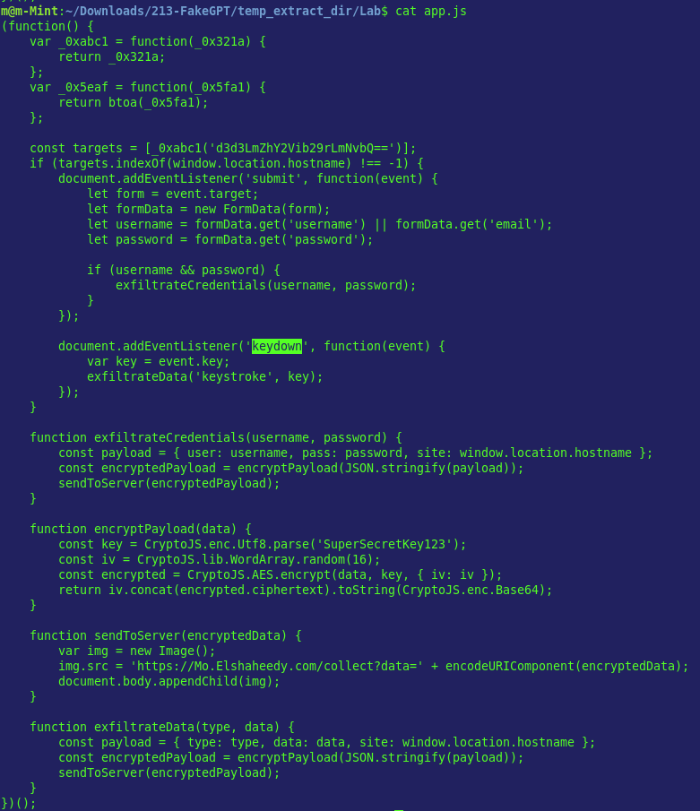
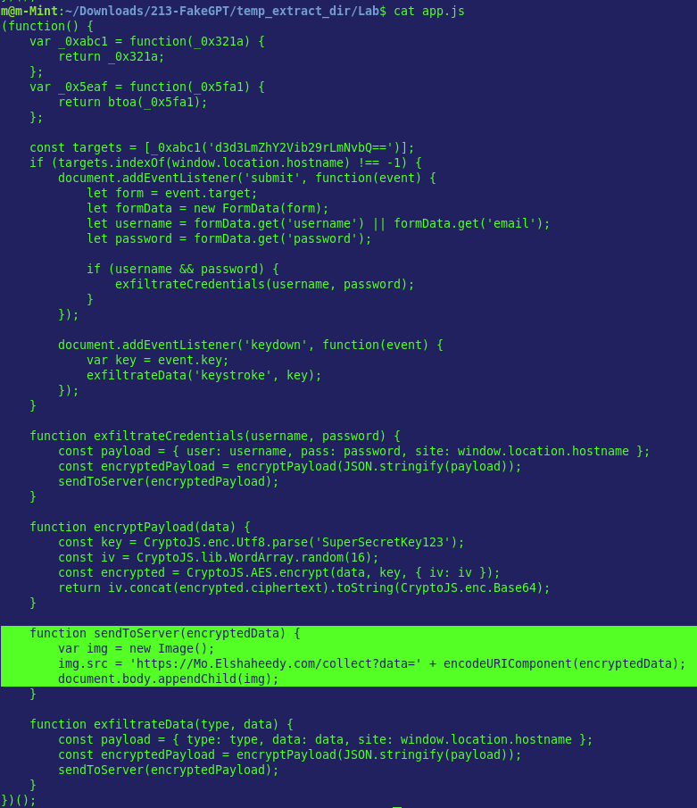
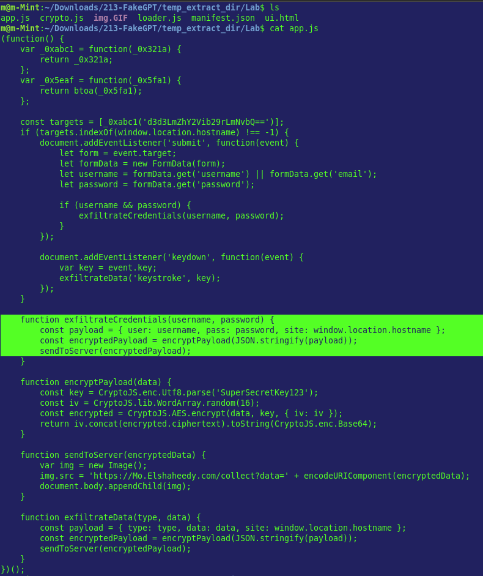
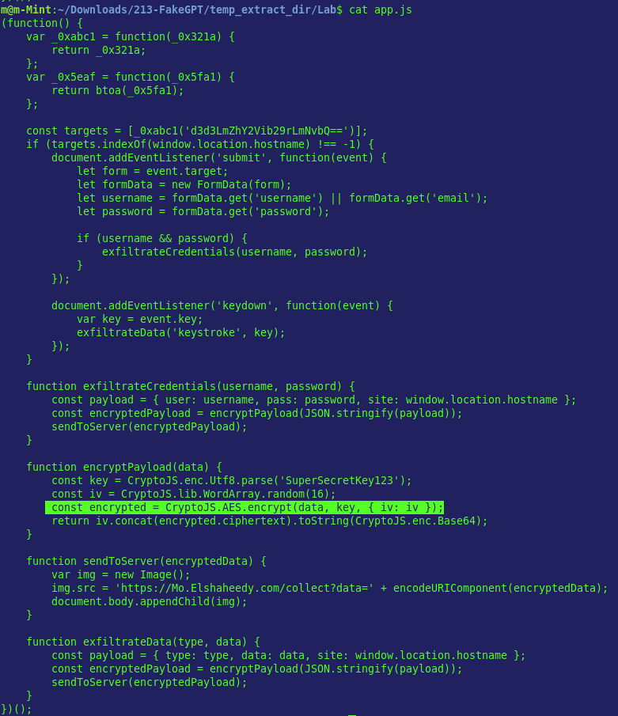
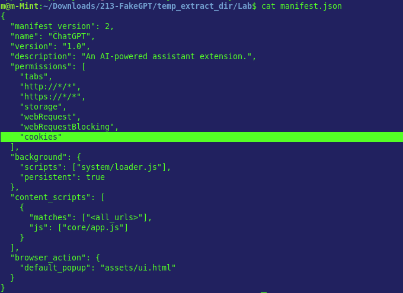

# Incident Response Report
## Malicious Browser Extension — Credential Theft & Data Exfiltration via Fake "ChatGPT" Extension

---

| Field              | Details                                      |
|--------------------|----------------------------------------------|
| **Severity**       | Critical                                     |
| **Status**         | Closed                                       |
| **Analyst**        | Murillo H. W. G.                             |
| **Date**           | 2025-06-11                                   |
| **Platform**       | CyberDefenders                               |
| **Classification** | TLP:WHITE                                    |

---

## Table of Contents

1. [Executive Summary](#1-executive-summary)
2. [Scope & Methodology](#2-scope--methodology)
3. [Attack Timeline](#3-attack-timeline)
4. [Technical Findings](#4-technical-findings)
5. [Indicators of Compromise (IOCs)](#5-indicators-of-compromise-iocs)
6. [Impact Assessment](#6-impact-assessment)
7. [Appendix](#7-appendix)
8. [Concepts & Recommendations](#8-concepts--recommendations)

---

## 1. Executive Summary

A malicious browser extension disguised as "ChatGPT" was distributed to users within the organization. Once installed, the extension monitored browser activity, intercepted form submissions and keystrokes, and exfiltrated credentials and session cookies to an attacker-controlled domain. Facebook accounts were the primary target, with stolen credentials transmitted via AES-encrypted payloads using a covert `` tag injection technique. The campaign resulted in confirmed account compromises and sensitive data leakage across affected workstations.

> **Risk Level: CRITICAL** — The extension achieved full credential and session hijacking with active exfiltration to an external C2 domain, bypassing standard network controls.

---

## 2. Scope & Methodology

### Scope

| Item             | Value                                               |
|------------------|-----------------------------------------------------|
| Evidence File    | Malicious browser extension source files (JS/manifest) |
| Analysis Tool(s) | Static code analysis, CyberChef (Base64 decode)     |
| Target           | End-user browsers (Chrome extension context)        |
| Analysis Type    | Post-incident forensic / Malware analysis           |

### Methodology

1. Extracted and reviewed the extension's manifest and JavaScript source files for suspicious permissions and behaviors.
2. Identified encoded strings and decoded them using Base64 to reveal obfuscated target URLs and C2 infrastructure.
3. Mapped all event listeners (`submit`, `keydown`) and API calls to reconstruct the data-capture logic.
4. Traced the exfiltration path from credential capture through AES encryption to the outbound `` request.
5. Reviewed cookie access patterns to assess session hijacking scope.
6. Documented all IOCs and correlated findings to the MITRE ATT&CK framework.

---

## 3. Attack Timeline

```
[Phase 1 — Installation & Persistence]
    └── User installs fake "ChatGPT" extension; extension gains broad browser permissions
        including access to cookies, form data, and all web requests.

[Phase 2 — Target Identification & Anti-Analysis Check]
    └── Extension checks for sandbox/analysis environment:
        navigator.plugins.length === 0 triggers self-deactivation.
        If check passes, begins monitoring for www.facebook.com.

[Phase 3 — Credential Harvesting]
    └── submit event listener intercepts form submissions on the target site.
        keydown API captures individual keystrokes in real time.
        exfiltrateCredentials(username, password) packages stolen data.

[Phase 4 — Session Hijacking]
    └── Extension accesses browser cookies to steal session tokens
        and authentication information for the monitored site.

[Phase 5 — Encrypted Exfiltration]
    └── Stolen credentials and cookies are encrypted with AES.
        Data is transmitted to Mo.Elshaheedy.com via a covert  tag
        (GET request embedded in image src), bypassing content-based filters.
```

---

## 4. Technical Findings

### 4.1 Obfuscation Method — Base64 Encoding

The extension uses **Base64** encoding to obscure target URLs and C2 references within the source code, making static analysis and signature-based detection more difficult. Encoded strings are decoded at runtime before use.

| Field          | Value                                      |
|----------------|--------------------------------------------|
| Encoding       | Base64                                     |
| Purpose        | Obfuscate target site URLs and C2 domain   |
| Decoded with   | CyberChef / `atob()` (native JS)           |

**Evidence:**

> `Q1-encoding-method-base64.png` — Base64-encoded string identified in extension JS source.



---

### 4.2 Target Site Identification — Facebook

The extension specifically targets **www.facebook.com**, monitoring the page for login form activity to harvest credentials. The URL is stored in encoded form and decoded at runtime.

| Field           | Value               |
|-----------------|---------------------|
| Monitored Site  | www.facebook.com    |
| Storage Method  | Base64-encoded string in source |

**Evidence:**

> `Q2(1)-encoded-monitored-site.png` — Encoded target URL as it appears in the extension source.

-encoded-monitored-site.png)

> `Q2(2)-decoded-monitored-site.png` — Decoded value revealing www.facebook.com as the target.

-decoded-monitored-site.png)

---

### 4.3 Covert Exfiltration via `` Tag

To transmit stolen data without triggering XMLHttpRequest or Fetch API monitors, the extension injects an `` HTML element with the stolen data embedded in the `src` URL as query parameters. This technique abuses the browser's passive resource-loading behavior.

| Field              | Value                                          |
|--------------------|------------------------------------------------|
| HTML Element       | ``                                        |
| Technique          | Data appended to `src` URL (GET exfiltration)  |
| Why effective      | Bypasses CSP and XHR-level network monitoring  |

**Evidence:**

> `Q3-html-element-stolen-data.png` — `` element used to carry stolen data in the request URL.



---

### 4.4 Anti-Analysis / Self-Deactivation Condition

The extension implements an environment check to evade sandbox analysis. The first condition that triggers self-deactivation is:

```javascript
navigator.plugins.length === 0
```

Browser automation environments and sandboxes typically report zero plugins. If this condition is true, the extension halts its malicious routines.

| Field       | Value                              |
|-------------|------------------------------------|
| Check       | `navigator.plugins.length === 0`   |
| Trigger     | No plugins detected (sandbox/VM)   |
| Action      | Extension deactivates itself       |

**Evidence:**

> `Q4-deactive-itself-function.png` — Self-deactivation logic with the plugin count condition.



---

### 4.5 Form Submission Interception — `submit` Event

The extension registers a listener for the **`submit`** event on forms within the target page. This allows it to capture credentials at the moment the user attempts to log in, before the data is sent to the legitimate server.

| Field        | Value      |
|--------------|------------|
| Event Type   | `submit`   |
| Target       | Login forms on www.facebook.com |
| Timing       | Fires on user form submission   |

**Evidence:**

> `Q5-event-capture-user-input.png` — `submit` event listener registered in the extension's content script.



---

### 4.6 Keystroke Monitoring — `keydown` API

In addition to form interception, the extension monitors **`keydown`** events to capture individual keystrokes in real time. This provides a secondary credential capture path, independent of form submission.

| Field       | Value       |
|-------------|-------------|
| API / Event | `keydown`   |
| Scope       | All keyboard input on monitored page |

**Evidence:**

> `Q6-method-monitoring-keystrokes.png` — `keydown` listener implementation for real-time keystroke capture.



---

### 4.7 C2 Exfiltration Domain

All stolen data is transmitted to the attacker-controlled domain **Mo.Elshaheedy.com**. This domain serves as the command-and-control (C2) receiver for the exfiltrated credentials and session data.

| Field      | Value               |
|------------|---------------------|
| C2 Domain  | Mo.Elshaheedy.com   |
| Protocol   | HTTP GET (via `` src) |

**Evidence:**

> `Q7-domain-toSend-exfiltrateData.png` — C2 domain hardcoded in the exfiltration function.



---

### 4.8 Credential Exfiltration Function

The function **`exfiltrateCredentials(username, password)`** is responsible for packaging and transmitting captured credentials. It receives the username and password as arguments, encrypts them, and triggers the ``-based exfiltration.

| Field         | Value                                    |
|---------------|------------------------------------------|
| Function      | `exfiltrateCredentials(username, password)` |
| Input         | Captured username and password           |
| Output        | AES-encrypted payload sent to C2         |

**Evidence:**

> `Q8-credential-exfiltrate-function.png` — Definition and invocation of `exfiltrateCredentials()` in the extension source.



---

### 4.9 AES Encryption of Exfiltrated Data

Before transmission, the stolen credentials are encrypted using the **AES** (Advanced Encryption Standard) algorithm. This protects the payload from interception during transit and complicates forensic recovery of stolen data from network captures.

| Field               | Value |
|---------------------|-------|
| Encryption Algorithm | AES  |
| Applied to          | Username, password, and session data before exfiltration |

**Evidence:**

> `Q9-encrp-algoritm-applied-bf-send.png` — AES encryption call applied to the credential payload prior to transmission.



---

### 4.10 Cookie Access for Session Hijacking

The extension accesses browser **cookies** to retrieve session tokens and authentication information. This enables session hijacking independent of credential capture — even users with MFA can be compromised if a valid session cookie is stolen.

| Field         | Value                                           |
|---------------|-------------------------------------------------|
| Data Accessed | Browser cookies                                 |
| Purpose       | Steal session tokens / authentication info      |
| Risk          | Session hijacking bypassing MFA                 |    

**Evidence:**

> `Q10-extension-storage-session-data.png` — Cookie access API calls within the extension for session data retrieval.



---

## 5. Indicators of Compromise (IOCs)

| Type        | Value                                        | Context                                         |
|-------------|----------------------------------------------|-------------------------------------------------|
| Domain      | Mo.Elshaheedy.com                            | C2 exfiltration endpoint                        |
| URL/URI     | `http(s)://Mo.Elshaheedy.com/?[data]`        | GET request via `` src carrying AES payload|
| Site Target | www.facebook.com                             | Monitored site for credential harvesting        |
| Function    | `exfiltrateCredentials(username, password)`  | Credential packaging and exfiltration function  |
| Event       | `submit`                                     | Form interception trigger                       |
| Event       | `keydown`                                    | Real-time keystroke capture                     |
| Encoding    | Base64                                       | Obfuscation of URLs and strings in source       |
| Algorithm   | AES                                          | Payload encryption before exfiltration          |
| HTML Element| ``                                      | Covert data exfiltration channel                |
| Data Type   | Browser Cookies                              | Session token theft                             |

---

## 6. Impact Assessment

| Impact Area             | Severity | Description                                                                 |
|-------------------------|----------|-----------------------------------------------------------------------------|
| Data Confidentiality    | Critical | Plaintext credentials captured before encryption; session cookies stolen    |
| Account Takeover        | Critical | Facebook credentials and session tokens enable full account compromise      |
| Session Hijacking       | Critical | Cookie theft bypasses MFA; attacker can impersonate user without password   |
| Detection Evasion       | High     | Anti-sandbox check, Base64 obfuscation, and `` exfiltration evade controls |
| Data Integrity          | Medium   | No evidence of local file modification; impact confined to credential theft |
| System Availability     | Low      | Extension operates silently; no denial-of-service behavior observed         |

---

## 7. Appendix

### 7.1 Base64 Decoding — CyberChef

CyberChef was used to decode Base64-encoded strings extracted from the extension JavaScript source. This revealed the plaintext target URLs and C2 references that would otherwise be hidden from static string searches.

**Usage context:** Applied to findings [4.1] and [4.2].

**Sample decode operation:**
```
Input  (Base64): d3d3LmZhY2Vib29rLmNvbQ==
Output (Plain) : www.facebook.com
```

---

### 7.2 Extension Anti-Analysis Checks Summary

The extension implements multiple evasion techniques beyond the plugin check:

| Check                              | Behavior if True       |
|------------------------------------|------------------------|
| `navigator.plugins.length === 0`   | Self-deactivation      |
| Base64-encoded strings in source   | Evades string matching |
| `` GET exfiltration           | Bypasses XHR monitors  |
| AES-encrypted payload              | Obscures data in transit|

---

## 8. Concepts & Recommendations

### Vulnerability Root Causes

| Root Cause                                           | Related Finding |
|------------------------------------------------------|-----------------|
| Users allowed to install unvetted browser extensions | 4.1 – 4.10      |
| No endpoint monitoring for browser extension activity| 4.3, 4.7        |
| No network-level blocking of unknown external domains| 4.7             |
| MFA does not protect against cookie/session theft    | 4.10            |
| No Content Security Policy enforced at browser level | 4.3             |

### Remediation Recommendations

**1. Extension Management Policy — Immediate**
- Enforce an allowlist of approved browser extensions via Group Policy (Chrome) or MDM.
- Block installation of extensions from outside the Chrome Web Store or not on the approved list.
- Audit and remove all unapproved extensions from affected workstations immediately.

**2. Network Controls — Immediate**
- Block outbound requests to `Mo.Elshaheedy.com` at the perimeter firewall and DNS resolver.
- Implement DNS filtering (e.g., Cisco Umbrella, Pi-hole) to block unknown or newly registered domains.
- Alert on outbound HTTP GET requests containing high-entropy query parameters (potential ``-based exfiltration).

**3. Endpoint Detection — Short-term**
- Deploy a browser security extension or EDR capable of monitoring extension behavior and network requests initiated by extensions.
- Create detection rules for `navigator.plugins` API access and `document.createElement('img')` calls originating from extension contexts.

**4. Session Security — Short-term**
- Force a full session token rotation and password reset for all affected users.
- Enable short session expiry and implement re-authentication requirements for sensitive actions on corporate accounts.
- Evaluate hardware-based MFA (FIDO2/WebAuthn) — resistant to session cookie hijacking unlike TOTP.

**5. User Awareness — Long-term**
- Train users to verify extension publishers and requested permissions before installation.
- Establish a process for reporting suspicious browser behavior to the security team.

---

### MITRE ATT&CK Mapping

| Technique ID | Name                               | Finding     |
|--------------|------------------------------------|-------------|
| T1176        | Browser Extensions                 | 4.1         |
| T1056.001    | Keylogging                         | 4.6         |
| T1185        | Browser Session Hijacking          | 4.10        |
| T1041        | Exfiltration Over C2 Channel       | 4.7, 4.8    |
| T1027        | Obfuscated Files or Information    | 4.1         |
| T1497        | Virtualization/Sandbox Evasion     | 4.4         |
| T1573.001    | Encrypted Channel: Symmetric Crypto| 4.9         |

---

*Report generated as part of Blue Team / DFIR lab exercise.*
*All findings are based on analysis performed in a controlled lab environment.*
