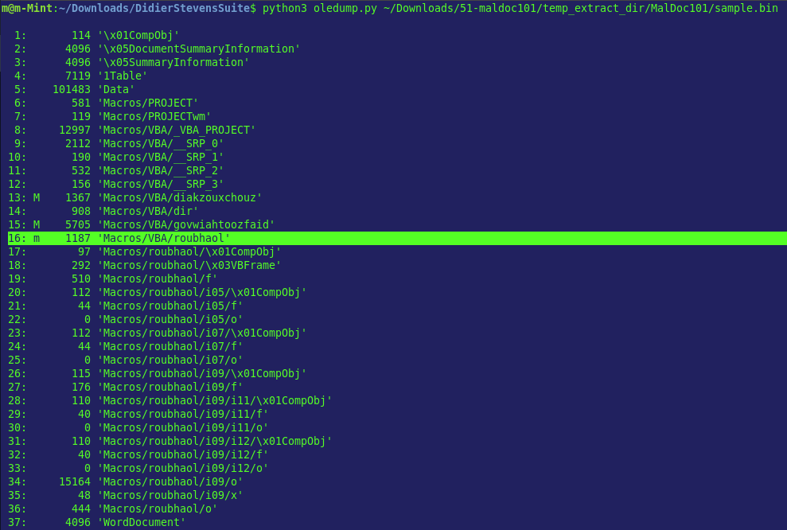
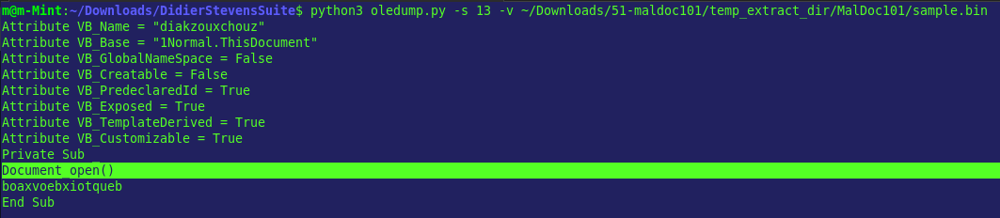
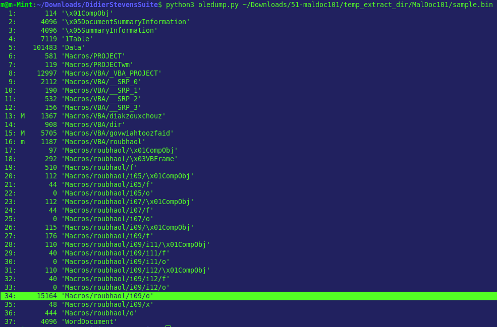
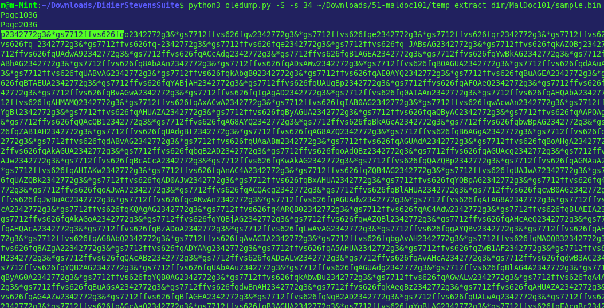
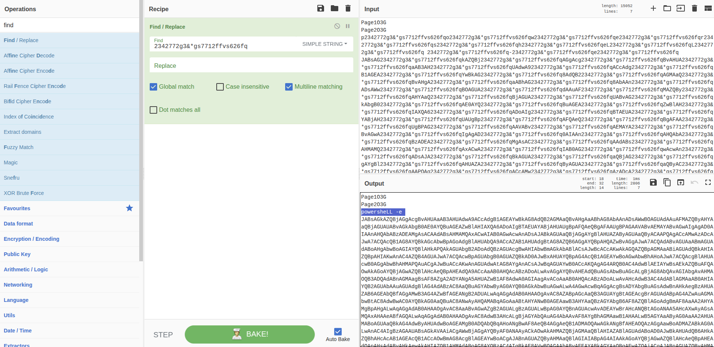
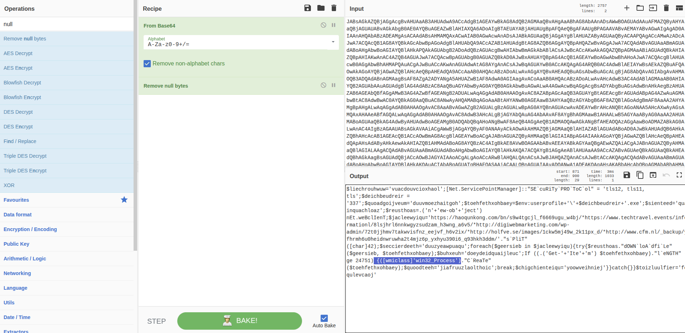
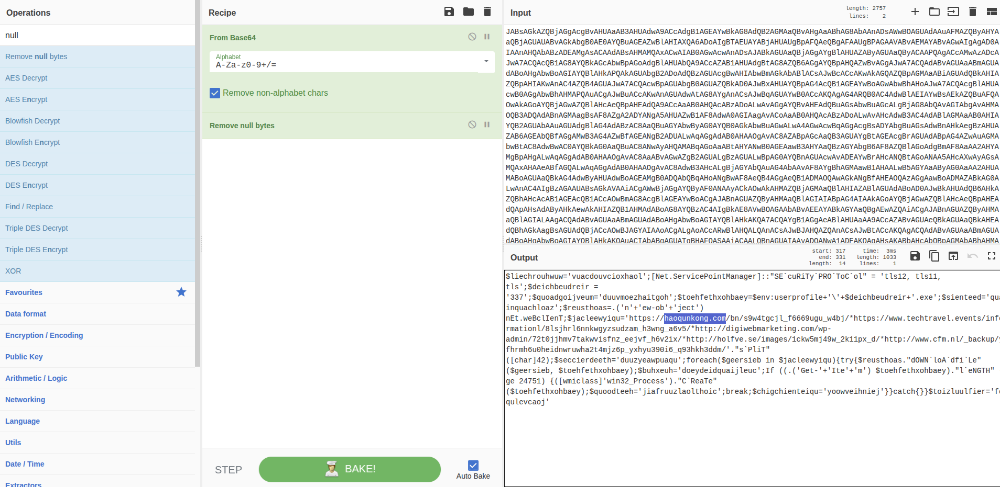

# Incident Response Report
## Emotet Macro Document — Static Analysis of Obfuscated PowerShell Dropper

---

| Field              | Details                          |
|--------------------|----------------------------------|
| **Severity**       | High |
| **Status**         | Closed |
| **Analyst**        | Murillo H. W. G. |
| **Date**           | 2026-06-24 |
| **Platform**       | CyberDefenders |
| **Classification** | TLP:WHITE |

---

## Table of Contents

1. [Executive Summary](#1-executive-summary)
2. [Scope & Methodology](#2-scope--methodology)
3. [Attack Timeline](#3-attack-timeline)
4. [Technical Findings](#4-technical-findings)
5. [Indicators of Compromise (IOCs)](#5-indicators-of-compromise-iocs)
6. [Impact Assessment](#6-impact-assessment)
7. [Appendix](#7-appendix)
8. [Concepts & Recommendations](#8-concepts--recommendations)

---

## 1. Executive Summary

This lab analyzed a malicious document containing multiple macro streams, an obfuscated Base64 payload, and PowerShell-based execution logic consistent with Emotet-style delivery. The document used the `Document_open` event to trigger execution, then leveraged encoded content and WMI-based process creation to launch the next-stage payload.

> **Risk Level: HIGH** — The document was designed to execute code automatically and retrieve a Trojan, which is a strong indicator of active malware delivery capability.

---

## 2. Scope & Methodology

### Scope

| Item             | Value |
|------------------|-------|
| Evidence File    | Malicious Office document artifacts |
| Analysis Tool(s) | Static analysis, CyberChef, document stream inspection |
| Target           | Microsoft Office document / macro payload |
| Analysis Type    | Post-incident forensic / static analysis |

### Methodology

1. Inspected document streams to identify macro-bearing content and the highest macro stream number.
2. Reviewed VBA execution flow to determine the trigger event and user-form usage.
3. Decoded and analyzed the Base64-obfuscated payload to identify the executed program and WMI process creation behavior.
4. Correlated domain indicators and malware family artifacts to map the delivery chain.

---

## 3. Attack Timeline

```text
[Initial Document Open]
    └── Macro execution begins via Document_open

[Payload Preparation]
    └── Obfuscated Base64 string stored and decoded from stream 34

[Execution]
    └── PowerShell launched by decoded payload

[Process Launch / Delivery]
    └── WMI Win32_Process used to create the Trojan process
    └── External domain contacted to retrieve the next stage
```

---

## 4. Technical Findings

### 4.1 Macro Execution Trigger

The document executed its malicious macro logic when the file was opened, using the `Document_open` event as the entry point. This behavior is consistent with common maldoc infection chains that avoid explicit user interaction beyond opening the file.

| Field | Value |
|--------|-------|
| Trigger Event | `Document_open` |
| Macro Stream | Highest macro stream: `16` |
| Initial Technique | Auto-execution via Office macro |

**Evidence:**

> `Q1-highest-stream-macro.png` — Shows the highest macro stream number identified in the document.

> `Q2-event-used-to-begin-exec.png` — Shows the event used to begin macro execution.





### 4.2 Malware Family Identification

Static analysis indicated the document was attempting to drop an `Emotet` payload. The artifact set showed hashing and family identification consistent with a malicious downloader workflow.

| Field | Value |
|--------|-------|
| Malware Family | `Emotet` |
| Related Artifact | Malware binary hashing / identification |
| Delivery Role | Trojan dropper / downloader |

**Evidence:**

> `Q3(1)-hashing-malware-bin.png` — Shows hashing or malware binary analysis used to support identification.

> `Q3(2)-found-malware-family.png` — Shows the malware family determination.

-hashing-malware-bin.png)

-found-malware-family.png)

### 4.3 Encoded Payload Storage

The Base64-encoded string was stored in stream `34`, which separated the payload from the primary macro logic. This is a common obfuscation technique to hide the next-stage execution content from casual inspection.

| Field | Value |
|--------|-------|
| Encoded Payload Stream | `34` |
| Encoding Type | Base64 |
| Purpose | Store obfuscated execution content |

**Evidence:**

> `Q4-enconded-b64.png` — Shows the stream containing the encoded Base64 string.



### 4.4 Obfuscation and PowerShell Execution

The Base64 string was padded or obfuscated with the value `2342772g3&*gs7712ffvs626fq`, and the decoded result executed `powershell`. This confirms the document used a script-based execution chain rather than direct binary execution.

| Field | Value |
|--------|-------|
| Obfuscation Value | `2342772g3&*gs7712ffvs626fq` |
| Executed Program | `powershell` |
| Technique | Encoded command execution |

**Evidence:**

> `Q6-obfuscated-b64-string.png` — Shows the obfuscated Base64 string.

> `Q7-executed-program-cyberchef.png` — Shows the decoded program execution result.





### 4.5 Process Creation via WMI

The malicious chain used the `Win32_Process` WMI class to create a process and launch the Trojan. This is a notable LOTL technique because it relies on legitimate Windows management interfaces to execute code.

| Field | Value |
|--------|-------|
| WMI Class | `Win32_Process` |
| Function | Process creation |
| Technique | Living-off-the-land execution |

**Evidence:**

> `Q8-win32_process.png` — Shows the WMI class used to create the process.



### 4.6 External Trojan Retrieval

The first contacted FQDN used to download the Trojan was `haoqunkong.com`. This domain is part of the outbound infrastructure involved in the malware delivery sequence.

| Field | Value |
|--------|-------|
| First FQDN | `haoqunkong.com` |
| Activity | Trojan download / command-and-delivery stage |
| Relevance | External infrastructure IOC |

**Evidence:**

> `Q9-first-FQDN-domain.png` — Shows the first domain contacted in the download chain.



---

## 5. Indicators of Compromise (IOCs)

| Type | Value | Context |
|------|-------|---------|
| Macro Stream | `16` | Highest macro stream found in the document. |
| Event | `Document_open` | Trigger used to start macro execution. |
| Malware Family | `Emotet` | Family associated with the malicious dropper. |
| Encoded Payload Stream | `34` | Stream storing the Base64-encoded string. |
| Obfuscation String | `2342772g3&*gs7712ffvs626fq` | Padding / obfuscation value used in the encoded string. |
| Program | `powershell` | Program executed by the decoded payload. |
| WMI Class | `Win32_Process` | Used to create the process launching the Trojan. |
| Domain | `haoqunkong.com` | First FQDN contacted to download the Trojan. |

---

## 6. Impact Assessment

| Impact Area | Severity | Description |
|-------------|----------|-------------|
| System Integrity | High | The document attempted to execute malicious code and launch a Trojan. |
| Remote Code Execution | High | PowerShell and WMI were used to run attacker-controlled logic. |
| Data Confidentiality | Medium | No exfiltration was confirmed in the provided artifacts. |
| System Availability | Medium | No evidence of disruption or destructive behavior was observed. |

---

## 7. Appendix

### 7.1 CyberChef Decoding Workflow

CyberChef was used to decode and validate the obfuscated Base64 payload, which helped confirm the use of `powershell` as the execution target. This step was important for linking the encoded content to the actual command behavior.

**Usage context:** Applied to findings 4.4 and 4.5.

### 7.2 Document Stream Review

Document stream inspection was used to identify macro locations, the trigger event, and the encoded payload storage stream. This was the primary static analysis method for the lab.

**Usage context:** Applied to findings 4.1 and 4.3.

---

## 8. Concepts & Recommendations

### Vulnerability Root Causes

| Root Cause | Related Finding |
|------------|-----------------|
| Macro-enabled Office content allowed automatic execution on document open. | 4.1 |
| Obfuscated Base64 payload hid the real execution logic. | 4.3, 4.4 |
| PowerShell and WMI were used as trusted execution paths. | 4.4, 4.5 |

### Remediation Recommendations

**1. Email / Document Controls — Immediate**
- Disable macro execution by default in Office documents.
- Block or quarantine suspicious attachments from untrusted sources.

**2. Endpoint Hardening — Short-term**
- Restrict PowerShell usage through Constrained Language Mode and logging.
- Monitor and alert on WMI-based process creation, especially `Win32_Process`.

**3. Detection Engineering — Short-term**
- Add detections for encoded PowerShell commands, Base64 decoding, and macro auto-run events.
- Flag outbound requests to newly seen or suspicious domains like `haoqunkong.com`.

**4. User Awareness — Long-term**
- Train users to treat unexpected documents as high-risk, especially those requesting macro enablement.
- Reinforce safe handling of office attachments and archive files.

---

*Report generated as part of Blue Team / DFIR lab exercise.*
*All findings are based on analysis performed in a controlled lab environment.*
