# Incident Response Report
## TechNova IIS Intrusion — Reconnaissance to Web Shell, Reverse Shell & RAT Deployment

---

| Field              | Details                          |
|--------------------|----------------------------------|
| **Severity**       | Critical                         |
| **Status**         | Closed                           |
| **Analyst**        | Murillo H. W. G.                 |
| **Date**           | 2025-06-10                       |
| **Platform**       | CyberDefenders                   |
| **Classification** | TLP:WHITE                        |

---

## Table of Contents

1. [Executive Summary](#1-executive-summary)
2. [Scope & Methodology](#2-scope--methodology)
3. [Attack Timeline](#3-attack-timeline)
4. [Technical Findings](#4-technical-findings)
5. [Indicators of Compromise (IOCs)](#5-indicators-of-compromise-iocs)
6. [Impact Assessment](#6-impact-assessment)
7. [Appendix](#7-appendix)
8. [Concepts & Recommendations](#8-concepts--recommendations)

---

## 1. Executive Summary

TechNova Systems' public-facing IIS server was compromised through a multi-stage intrusion initiated by an external threat actor from IP `10.0.2.4`. The attacker conducted automated reconnaissance using Nmap, enumerated SMB shares, and uploaded a malicious web shell (`shell.aspx`) to the server. Leveraging the web shell, the attacker established a reverse shell on port `4443` via the `w3wp.exe` process and deployed a UPX-packed AgentTesla RAT that persists at startup and beacons to a remote C2 domain. The incident resulted in full remote code execution, persistent access, and confirmed command-and-control communication.

> **Risk Level: CRITICAL** — Full system compromise confirmed with RCE, persistence via startup implant, and active C2 beaconing by a commodity RAT family.

---

## 2. Scope & Methodology

### Scope

| Item             | Value                                                                 |
|------------------|-----------------------------------------------------------------------|
| Evidence File    | `capture.pcap`, `memory.dmp`, `malware_sample.exe`                   |
| Analysis Tool(s) | Wireshark, Volatility, PEiD / DIE (Detect-It-Easy), VirusTotal       |
| Target           | Public-facing IIS web server (Windows), cloud-hosted by TechNova     |
| Analysis Type    | Post-incident forensic analysis                                       |

### Methodology

1. Loaded `capture.pcap` in Wireshark; filtered and analyzed HTTP, SMB, and TCP traffic to reconstruct the network-phase of the attack.
2. Identified the attacker IP via SYN flood / port-scan pattern and confirmed tooling from HTTP User-Agent headers.
3. Traced SMB Tree Connect requests to identify enumerated UNC share paths and extracted the uploaded web shell filename.
4. Identified the reverse shell callback port from TCP session analysis.
5. Analyzed `memory.dmp` with Volatility to extract kernel base address, process list, and on-disk path of the persistence implant.
6. Performed static analysis on the malware sample using PEiD/DIE to detect packer; submitted hash to VirusTotal to identify C2 domain and malware family.

---

## 3. Attack Timeline

```
[Phase 1] Reconnaissance
    └── Attacker (10.0.2.4) floods IIS host with rapid-fire probes using Nmap

[Phase 2] SMB Enumeration & Initial Access
    └── Attacker enumerates SMB shares (\\10.0.2.15\IPC$, \\10.0.2.15\Documents)
    └── Uploads web shell (shell.aspx) to the Documents share

[Phase 3] Execution & Reverse Shell
    └── Web shell (shell.aspx) executed via IIS (w3wp.exe, PID 4332)
    └── Reverse shell established back to attacker on port 4443

[Phase 4] Persistence & C2
    └── Malware implant (updatenow.exe) dropped to Startup folder
    └── UPX-packed AgentTesla RAT beacons to C2: cp8nl.hyperhost.ua
```

---

## 4. Technical Findings

### 4.1 Attacker Identification — Reconnaissance via Nmap

Network traffic analysis in Wireshark revealed a flood of rapid TCP SYN probes originating from `10.0.2.4` targeting the IIS host. The volume and timing are consistent with automated port scanning. HTTP request headers from the same source confirmed the use of **Nmap** as the scanning tool (via the `User-Agent` field).

| Field          | Value         |
|----------------|---------------|
| Attacker IP    | `10.0.2.4`    |
| Tool Identified | Nmap         |
| Target IP      | `10.0.2.15`   |
| Protocol       | TCP / HTTP    |

**Evidence:**

> `1-found-attacker-ip.png` — Wireshark capture showing high-frequency probes from `10.0.2.4` to the IIS host.

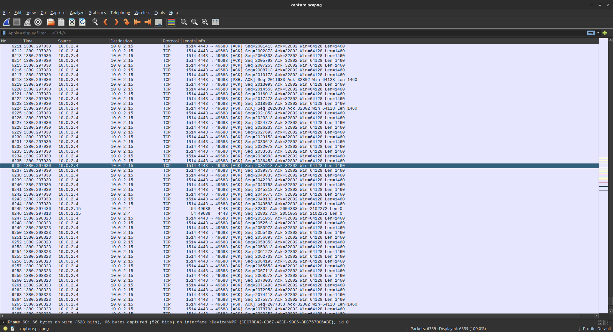

> `2-confirmed-attacker-used-nmap.png` — HTTP request header revealing Nmap as the scanning tool.

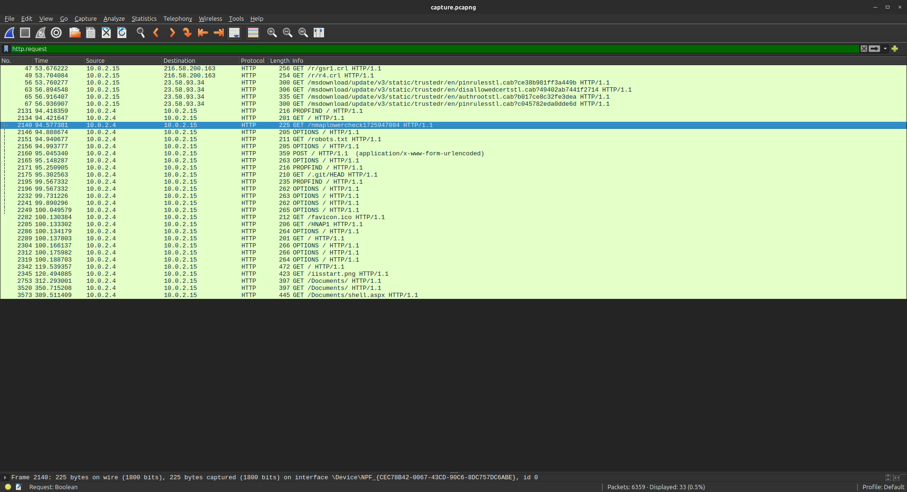

---

### 4.2 SMB Share Enumeration

Following reconnaissance, the attacker initiated SMB connections and sent consecutive Tree Connect requests targeting two shares on the IIS host. This exposes internal share enumeration behavior consistent with pre-upload staging.

| Field           | Value                        |
|-----------------|------------------------------|
| Share Path 1    | `\\10.0.2.15\IPC$`           |
| Share Path 2    | `\\10.0.2.15\Documents`      |
| Protocol        | SMB                          |
| Request Type    | Tree Connect                 |

**Evidence:**

> `3-smb-uncpaths-acessed.png` — SMB traffic showing two consecutive Tree Connect requests to IPC$ and Documents shares.

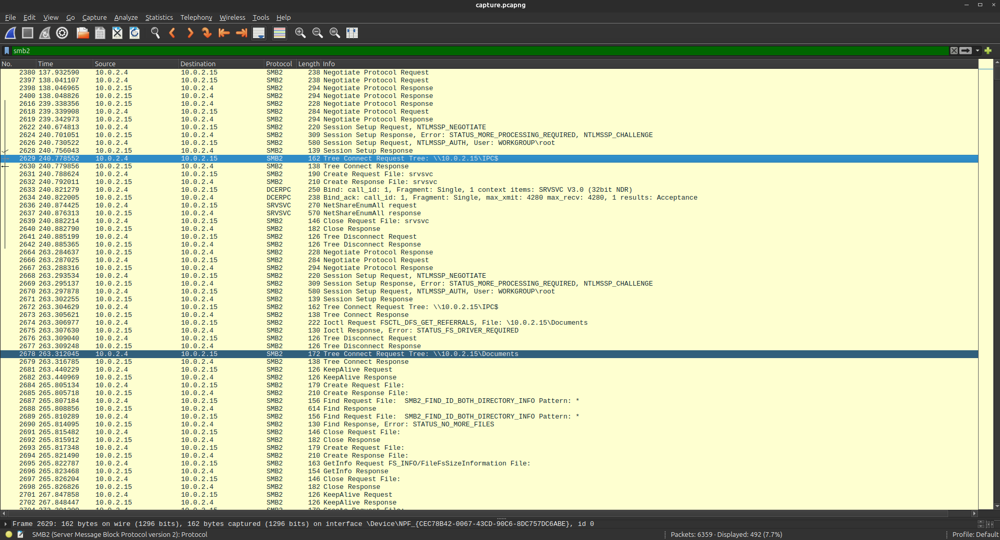

---

### 4.3 Web Shell Upload

The attacker leveraged write access to the `\\10.0.2.15\Documents` share to plant a web-accessible payload. The uploaded file `shell.aspx` is an ASP.NET web shell capable of accepting HTTP requests and executing arbitrary OS commands on the server.

| Field         | Value             |
|---------------|-------------------|
| Filename      | `shell.aspx`      |
| Upload Path   | `\\10.0.2.15\Documents` |
| File Type     | ASP.NET Web Shell |

**Evidence:**

> `4-attacker-payload.png` — SMB/HTTP traffic confirming the upload of `shell.aspx` to the target share.

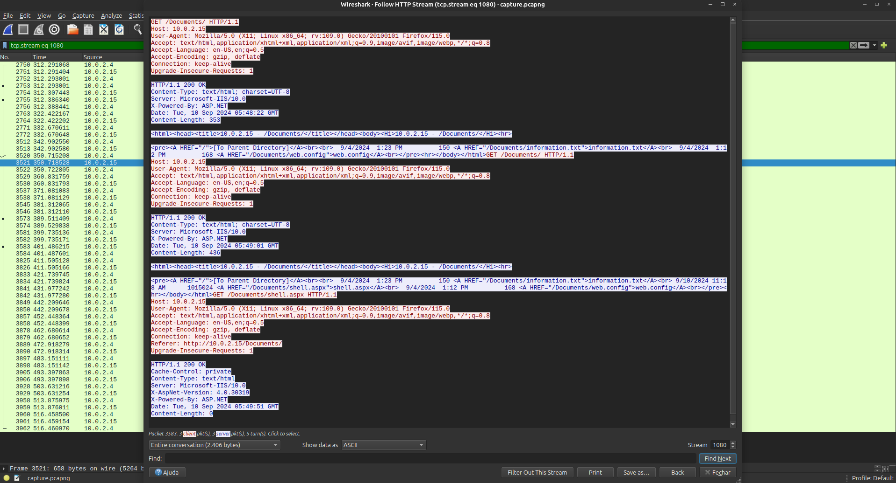

---

### 4.4 Reverse Shell Callback

After the web shell was activated via IIS, it established an outbound reverse shell connection to the attacker. The connection used port **4443** — an uncommon but firewall-friendly port that can bypass egress filtering rules targeting standard ports.

| Field             | Value     |
|-------------------|-----------|
| Reverse Shell Port | `4443`   |
| Direction         | Outbound (server → attacker) |
| IIS Process       | `w3wp.exe` (PID `4332`) |

**Evidence:**

> `5-firewall-port-usedby-attacker.png` — TCP session showing outbound connection from the IIS host to the attacker on port 4443.

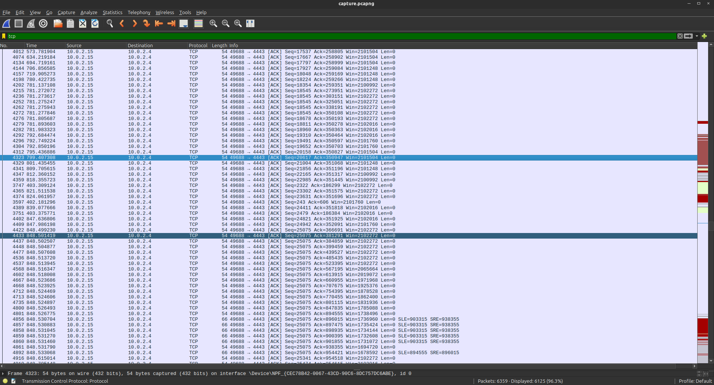

---

### 4.5 Memory Analysis — Kernel Base & Process Context

Volatility analysis of the memory dump provided kernel context and confirmed the process responsible for spawning the reverse shell and persistence implant. The kernel base address was extracted from the dump headers, and `w3wp.exe` (PID `4332`) — the IIS worker process — was identified as the parent of the malicious activity.

| Field               | Value                    |
|---------------------|--------------------------|
| Kernel Base Address | `0xf80079213000`         |
| Responsible Process | `w3wp.exe`               |
| PID                 | `4332`                   |

**Evidence:**

> `6-MEM-windows-info.png` — Volatility output showing kernel base address and system information from memory.

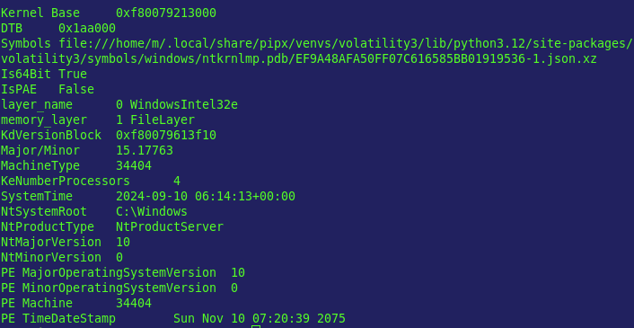

> `8-windows-process-implanted-exe.png` — Process list from memory confirming w3wp.exe (PID 4332) and the implanted executable.

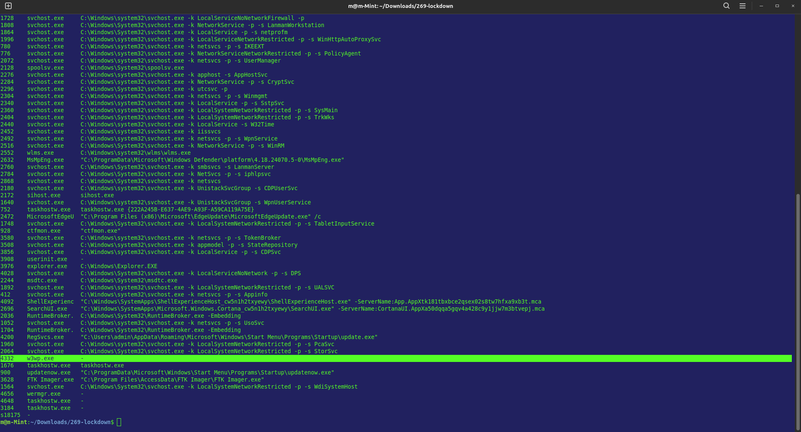

---

### 4.6 Persistence — Startup Implant

Memory analysis revealed that `w3wp.exe` spawned an executable located outside the standard IIS stack. The implant was placed in the Windows Startup folder, ensuring execution at every system boot — a classic persistence technique for commodity malware.

| Field          | Value                                                                                  |
|----------------|----------------------------------------------------------------------------------------|
| Implant Path   | `C:\ProgramData\Microsoft\Windows\Start Menu\Programs\Startup\updatenow.exe`           |
| Persistence Mechanism | Startup Folder (CSIDL_COMMON_STARTUP)                                         |
| Parent Process | `w3wp.exe` (PID `4332`)                                                               |

**Evidence:**

> `7-malware-upload-path-identified.png` — Volatility output showing the full on-disk path of the persistence implant.

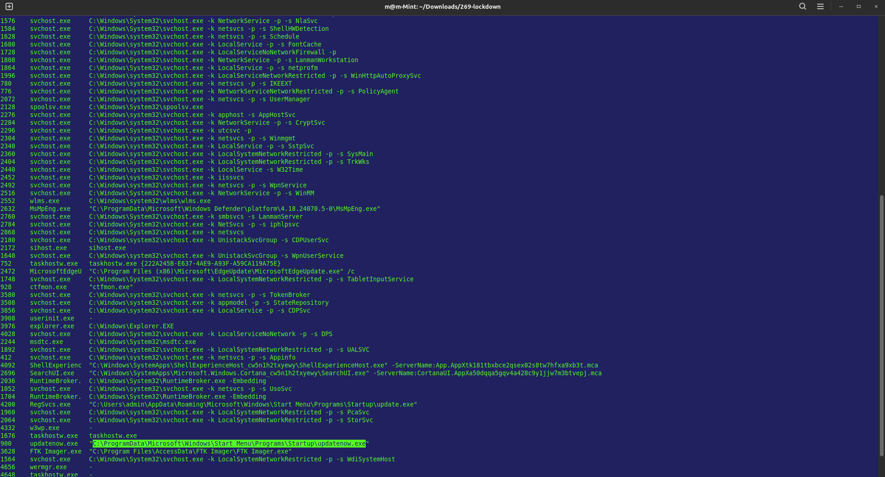

---

### 4.7 Malware Analysis — AgentTesla RAT

Static analysis of the recovered binary revealed it was packed with **UPX** to hinder reverse engineering. After unpacking and hash extraction, VirusTotal confirmed the sample belongs to the **AgentTesla** malware family — a well-known commodity RAT capable of keylogging, credential theft, and clipboard monitoring. The sample beacons to a C2 domain hosted in Ukraine.

| Field           | Value                    |
|-----------------|--------------------------|
| Packer          | UPX                      |
| Malware Family  | AgentTesla               |
| C2 FQDN         | `cp8nl.hyperhost.ua`     |

**Evidence:**

> `9-detected-malware-packer.png` — DIE/PEiD output confirming UPX packing on the malware sample.

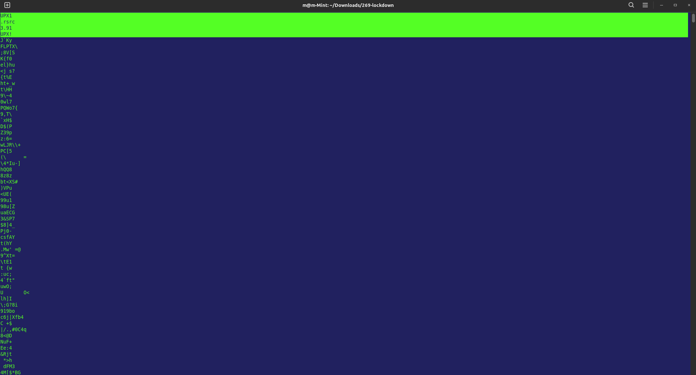

> `10-virusTotal-malware-domain.png` — VirusTotal report showing C2 domain `cp8nl.hyperhost.ua` associated with the sample hash.

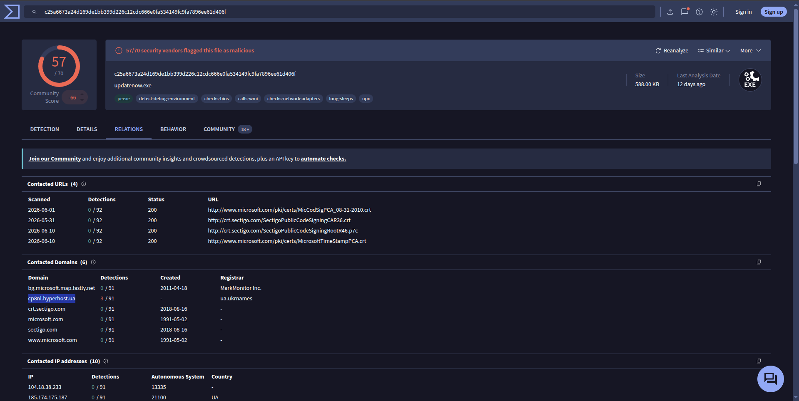

> `11-agentTesla-malware-family.png` — VirusTotal classification confirming AgentTesla as the malware family.

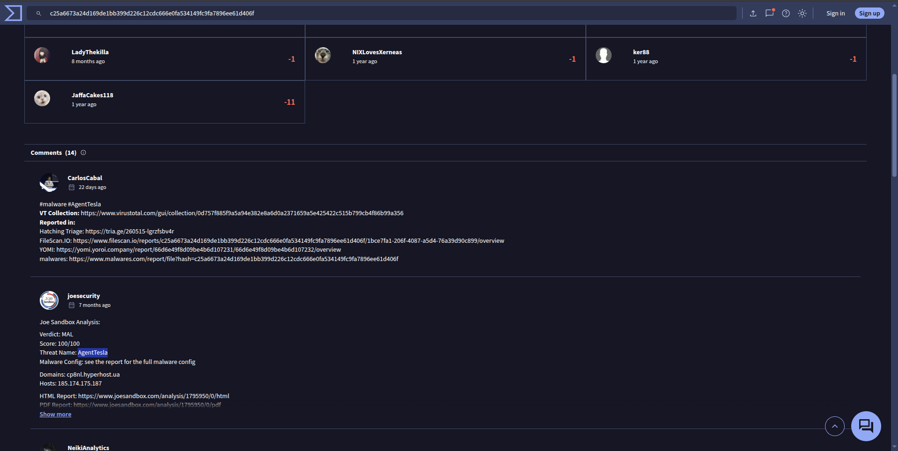

---

## 5. Indicators of Compromise (IOCs)

| Type         | Value                                                                                     | Context                                      |
|--------------|-------------------------------------------------------------------------------------------|----------------------------------------------|
| IP Address   | `10.0.2.4`                                                                                | Attacker source IP — reconnaissance & upload |
| IP Address   | `10.0.2.15`                                                                               | Victim IIS server                            |
| UNC Path     | `\\10.0.2.15\IPC$`                                                                        | SMB share enumerated by attacker             |
| UNC Path     | `\\10.0.2.15\Documents`                                                                   | SMB share used for web shell upload          |
| Filename     | `shell.aspx`                                                                              | Web shell planted on IIS server              |
| TCP Port     | `4443`                                                                                    | Reverse shell callback port                  |
| File Path    | `C:\ProgramData\Microsoft\Windows\Start Menu\Programs\Startup\updatenow.exe`              | Persistence implant (startup folder)         |
| Process      | `w3wp.exe` (PID `4332`)                                                                   | IIS worker process abused for execution      |
| Domain (C2)  | `cp8nl.hyperhost.ua`                                                                      | AgentTesla C2 beacon domain                  |
| Malware      | AgentTesla                                                                                | Commodity RAT family                         |
| Packer       | UPX                                                                                       | Used to obfuscate malware binary             |

---

## 6. Impact Assessment

| Impact Area              | Severity | Description                                                                                  |
|--------------------------|----------|----------------------------------------------------------------------------------------------|
| Remote Code Execution    | Critical | Web shell + reverse shell gave attacker full OS-level command execution on the IIS server    |
| Persistence              | Critical | Startup implant survives reboots; attacker retains access even after session termination     |
| C2 Communication         | Critical | AgentTesla actively beaconing to external C2; attacker may issue new commands at any time    |
| Data Confidentiality     | High     | AgentTesla is capable of keylogging and credential theft; exfiltration scope unconfirmed     |
| SMB Share Exposure       | High     | Write-accessible SMB share enabled web shell planting without authentication bypass needed   |
| System Availability      | Medium   | No evidence of service disruption, but implant execution at startup could destabilize system |

---

## 7. Appendix

### 7.1 Volatility — Memory Analysis Commands

Volatility 3 was used to analyze the memory dump and extract kernel base address, process list, and file artifact paths.

**Usage context:** Applied to findings 4.5 and 4.6.

```bash
# Identify kernel base address and OS profile
vol -f memory.dmp windows.info

# List all running processes
vol -f memory.dmp windows.pslist

# Identify processes and their full executable paths
vol -f memory.dmp windows.cmdline
vol -f memory.dmp windows.dlllist --pid 4332

# Search for files in suspicious paths
vol -f memory.dmp windows.filescan | grep -i startup
```

### 7.2 VirusTotal — Hash Submission

The malware sample was hashed (SHA256) and submitted to VirusTotal for threat intelligence lookup, confirming the AgentTesla family classification and the associated C2 infrastructure.

**Usage context:** Applied to finding 4.7.

---

## 8. Concepts & Recommendations

### Vulnerability Root Causes

| Root Cause                                           | Related Finding |
|------------------------------------------------------|-----------------|
| SMB share exposed to network with write permissions  | 4.2, 4.3        |
| IIS server lacked web shell detection controls       | 4.3, 4.4        |
| No egress filtering for uncommon outbound ports      | 4.4             |
| Startup folder writable by IIS worker process        | 4.6             |
| No EDR/AV detection of UPX-packed binary on disk     | 4.7             |

### Remediation Recommendations

**1. SMB Share Hardening — Immediate**
- Remove public write access from the `Documents` share; enforce least-privilege ACLs.
- Disable SMB access from external/cloud-facing network segments entirely.
- Enable SMB signing to prevent relay attacks in the same environment.

**2. IIS Web Shell Detection — Immediate**
- Deploy file integrity monitoring (FIM) on IIS `wwwroot` and all web-accessible directories.
- Configure IIS to block execution of `.aspx` files uploaded via SMB or non-deployment channels.
- Implement application allowlisting to prevent execution of unsigned or unknown scripts.

**3. Egress Traffic Filtering — Short-term**
- Block outbound connections on non-standard ports (e.g., `4443`) from IIS worker processes.
- Enforce egress firewall rules limiting `w3wp.exe` outbound communication to known service IPs only.
- Deploy a web application firewall (WAF) capable of detecting web shell command patterns.

**4. Persistence & Endpoint Hardening — Short-term**
- Restrict write access to startup folders (`CSIDL_COMMON_STARTUP`) for service accounts and IIS worker processes.
- Enable Windows Defender Application Control (WDAC) or AppLocker policies to block unsigned executables in `ProgramData`.
- Deploy EDR capable of detecting UPX-packed or dynamically unpacking binaries at runtime.

**5. Threat Intelligence & Monitoring — Long-term**
- Block known AgentTesla C2 infrastructure (including `hyperhost.ua` wildcard) at DNS and firewall level.
- Integrate IOCs from this incident into SIEM detection rules (IP `10.0.2.4`, domain `cp8nl.hyperhost.ua`, filename `shell.aspx`, port `4443`).
- Conduct a full credential rotation for all accounts accessible from the compromised IIS host, given AgentTesla's keylogging capability.

---

*Report generated as part of Blue Team / DFIR lab exercise.*  
*All findings are based on analysis performed in a controlled lab environment.*
