# Incident Response Report
## Web Application Attack — SQL Injection to Web Shell Deployment
---

## Table of Contents

1. [Executive Summary](#1-executive-summary)
2. [Scope & Methodology](#2-scope--methodology)
3. [Attack Timeline](#3-attack-timeline)
4. [Technical Findings](#4-technical-findings)
   - 4.1 [Attacker Identification](#41-attacker-identification)
   - 4.2 [Vulnerable Endpoint Discovery](#42-vulnerable-endpoint-discovery)
   - 4.3 [SQL Injection — Initial Probe](#43-sql-injection--initial-probe)
   - 4.4 [SQL Injection — Database Enumeration](#44-sql-injection--database-enumeration)
   - 4.5 [Table Enumeration](#45-table-enumeration)
   - 4.6 [Hidden Admin Directory Discovery](#46-hidden-admin-directory-discovery)
   - 4.7 [Credential Compromise](#47-credential-compromise)
   - 4.8 [Web Shell Upload](#48-web-shell-upload)
5. [Indicators of Compromise (IOCs)](#5-indicators-of-compromise-iocs)
6. [Impact Assessment](#6-impact-assessment)
7. [Appendix — Decoder Script](#7-appendix--decoder-script)
8. [Lessons Learned & Recommendations](#8-lessons-learned--recommendations)

---

## 1. Executive Summary

A full-chain web application attack was identified through network traffic analysis of a captured PCAP file. The attacker, originating from **Shijiazhuang, China (IP: 111.224.250.131)**, exploited a **SQL Injection vulnerability** in `search.php` to enumerate the database structure, discover a hidden administrative panel, compromise valid credentials, and ultimately **deploy a PHP web shell** on the target server.

The attack progressed from initial reconnaissance to full server compromise in a structured and methodical manner, consistent with an experienced threat actor or the use of automated exploitation tooling (e.g., `sqlmap`).

> **Risk Level: CRITICAL** — Remote code execution capability was achieved via web shell deployment.

---

## 2. Scope & Methodology

### Scope

| Item             | Value                              |
|------------------|------------------------------------|
| Evidence File    | `.pcap` network capture             |
| Analysis Tool    | Wireshark                          |
| Target           | Web application running `search.php` |
| Analysis Type    | Post-incident forensic analysis     |

### Methodology

The analysis followed a structured forensic approach:

1. Traffic pattern analysis via **Statistics → Conversations** in Wireshark
2. HTTP stream inspection and payload extraction
3. URL decoding of obfuscated SQL payloads (assisted by custom Python script)
4. Geolocation lookup of attacker IP
5. Reconstruction of the full attack chain

---

## 3. Attack Timeline

```
[Phase 1] Reconnaissance
    └── Attacker scans the application, identifies search.php as a candidate

[Phase 2] Vulnerability Confirmation
    └── Boolean-based SQLi probe: AND 1=1; -- -
    └── Application returns a valid response → vulnerability confirmed

[Phase 3] Database Enumeration
    └── UNION-based SQLi with INFORMATION_SCHEMA.SCHEMATA
    └── All available databases are listed

[Phase 4] Table Enumeration
    └── Attacker queries table names from discovered databases
    └── Sensitive table identified: customers

[Phase 5] Admin Discovery
    └── Hidden directory /admin/ discovered
    └── Login panel accessed

[Phase 6] Credential Compromise
    └── POST request to /admin/ with admin:admin123!
    └── HTTP 302 redirect → authentication successful

[Phase 7] Persistence — Web Shell Upload
    └── PHP file (NVri2vhp.php) uploaded via admin panel
    └── Content-Type: application/x-php
    └── Remote code execution capability established
```

---

## 4. Technical Findings

### 4.1 Attacker Identification

Traffic volume analysis via Wireshark's **Statistics → Conversations** revealed a single external IP responsible for an abnormally high number of HTTP requests directed at the web server.

| Field         | Value              |
|---------------|--------------------|
| Attacker IP   | `111.224.250.131`  |
| Country       | China              |
| City          | Shijiazhuang       |
| Protocol      | HTTP               |

**Evidence:**

> `1-webinvestigation-pcap.png` — PCAP opened in Wireshark, conversation list showing anomalous request volume from attacker IP.

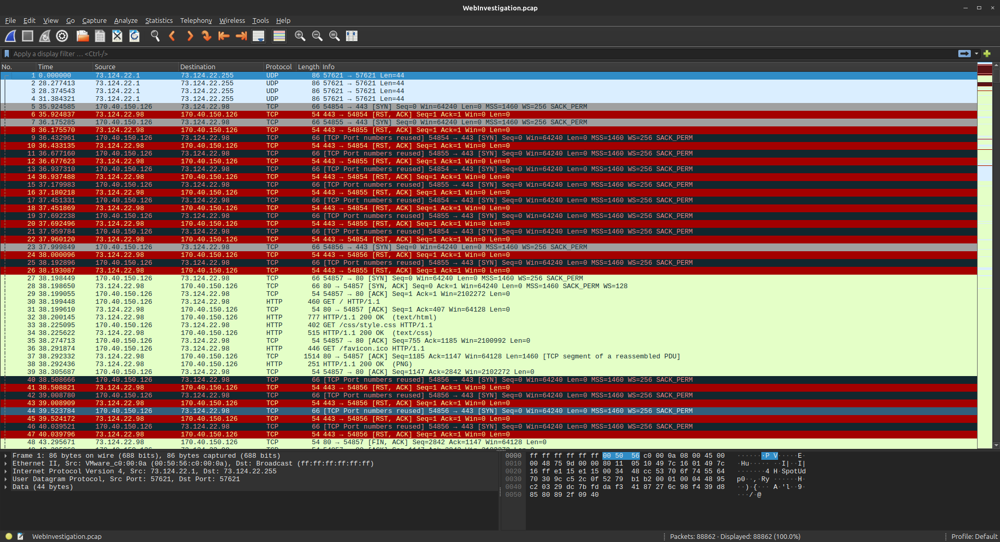

> `2-found-a-pattern.png` — Filtering HTTP traffic revealing the attack pattern directed at search.php.

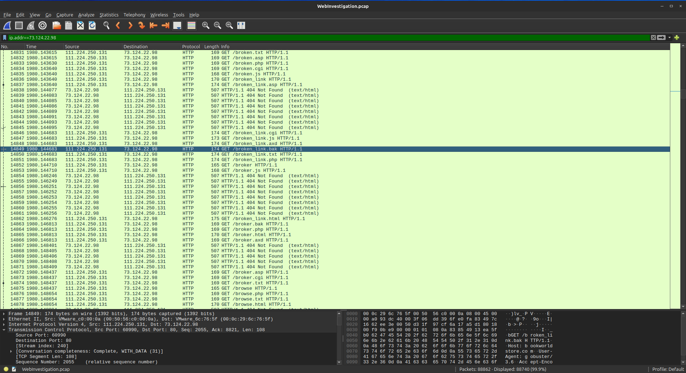

> `3-search-ip-location.png` — Geolocation lookup confirming attacker origin: Shijiazhuang, China.

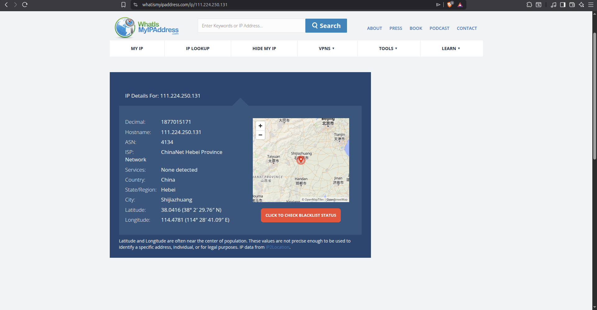

---

### 4.2 Vulnerable Endpoint Discovery

HTTP request inspection revealed that all attack payloads were directed at a single script.

| Field             | Value         |
|-------------------|---------------|
| Vulnerable Script | `search.php`  |
| Parameter         | `search`      |
| Vulnerability     | SQL Injection |

**Evidence:**

> `4-filter-php-script.png` — Wireshark display filter isolating requests to search.php.

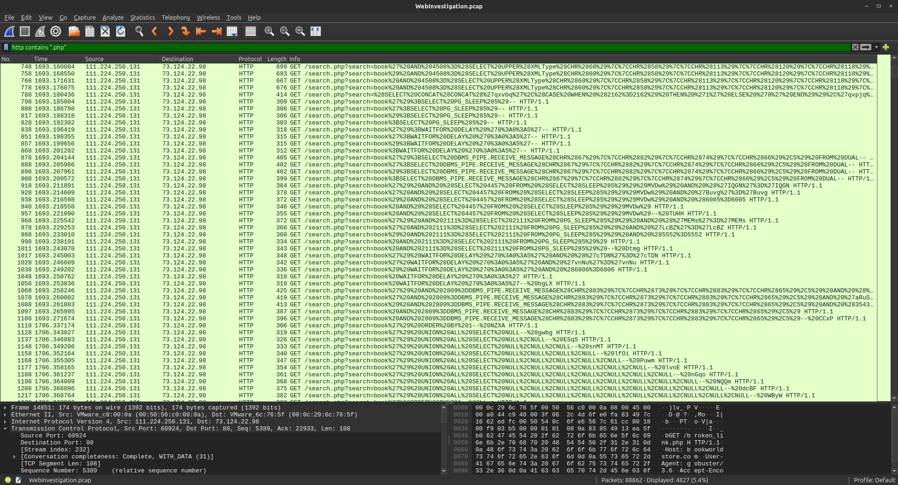

---

### 4.3 SQL Injection — Initial Probe

The attacker began with a classic **boolean-based** probe to confirm whether the `search` parameter was injectable.

**Payload:**
```
/search.php?search=book and 1=1; -- -
```

**Analysis:**

| Component   | Purpose                                              |
|-------------|------------------------------------------------------|
| `and 1=1`   | Always-true condition to test query manipulation     |
| `; -- -`    | Statement termination + comment to neutralize the rest of the original query |

A valid HTTP response to this request confirmed the application was vulnerable to SQL Injection.

---

### 4.4 SQL Injection — Database Enumeration

After confirming the vulnerability, the attacker escalated to a **UNION-based** injection to enumerate all databases on the server.

**Payload (URL-encoded):**
```
/search.php?search=book' UNION ALL SELECT NULL,CONCAT(0x7178766271,JSON_ARRAYAGG(CONCAT_WS(0x7a76676a636b,schema_name)),0x7176706a71) FROM INFORMATION_SCHEMA.SCHEMATA-- -
```

**Payload Breakdown:**

| Component                        | Purpose                                                  |
|----------------------------------|----------------------------------------------------------|
| `UNION ALL SELECT`               | Merges attacker query with original query result         |
| `INFORMATION_SCHEMA.SCHEMATA`    | System table listing all available databases             |
| `JSON_ARRAYAGG`                  | Aggregates multiple rows into a single JSON array        |
| `CONCAT_WS(0x7a76676a636b, ...)` | Joins values with a hex-encoded delimiter                |
| `0x7178766271` / `0x7176706a71`  | Hex-encoded boundary markers to extract data cleanly     |

**Evidence:**

> `5-coded-SQL-injection.png` — Raw URL-encoded SQLi payload captured in Wireshark HTTP stream.

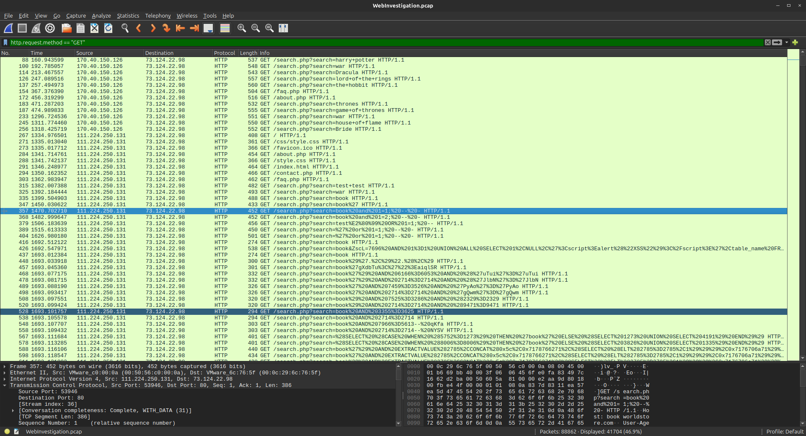

> `6-found-information_schema-url.png` — Decoded URL confirming INFORMATION_SCHEMA enumeration query.

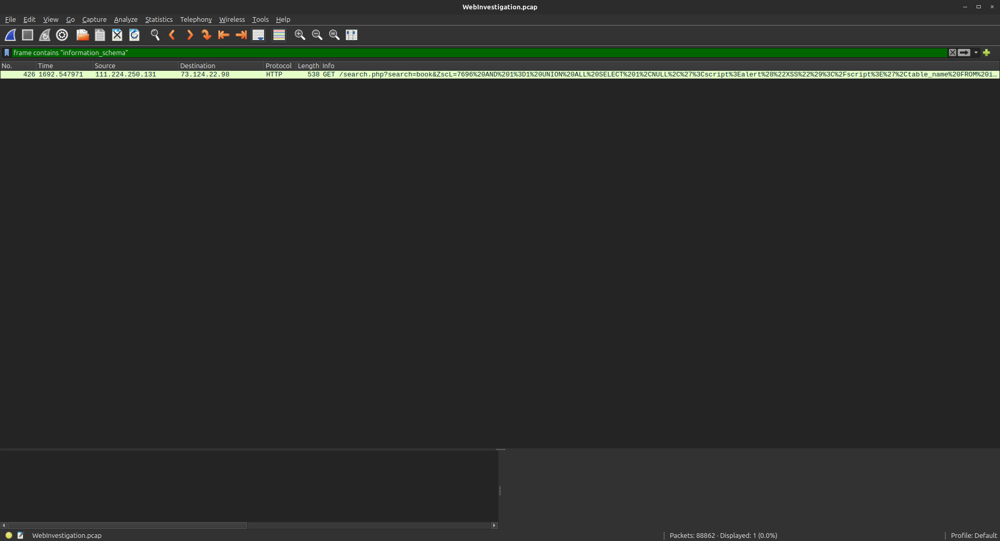

> `7-decode-script-py.png` — Python decoder script used to process URL-encoded payloads.

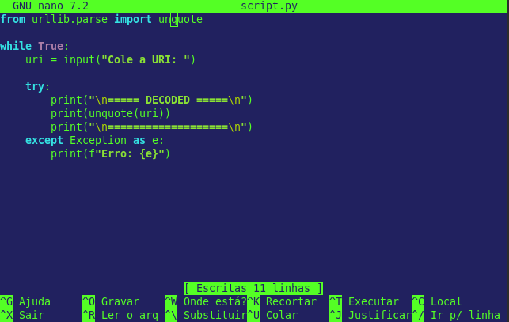

> `8-got-decode-url.png` — Script output showing decoded payload in plaintext.

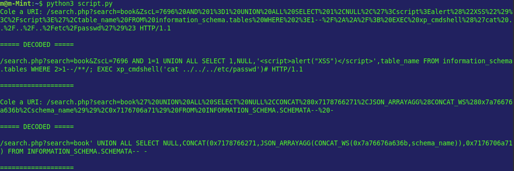

---

### 4.5 Table Enumeration

Following database discovery, the attacker queried table names from the identified databases to locate sensitive data stores.

**Result:**

| Finding          | Value       |
|------------------|-------------|
| Identified Table | `customers` |

**Evidence:**

> `9-found-table-usersdata.png` — HTTP response body revealing the customers table in the database structure.

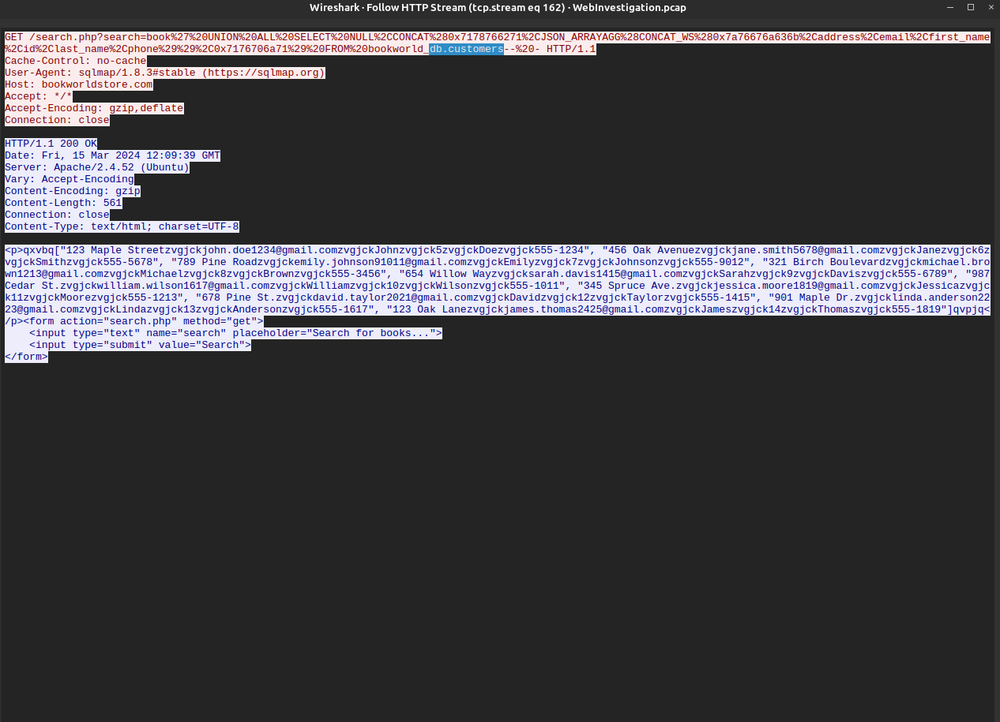

---

### 4.6 Hidden Admin Directory Discovery

The attacker identified a non-publicly advertised administrative directory, likely through directory enumeration or inspection of application responses.

| Field              | Value    |
|--------------------|----------|
| Discovered Path    | `/admin/` |
| Discovery Method   | Directory enumeration / application response analysis |

**Evidence:**

> `10-admin-hidden-dir.png` — HTTP request/response confirming access to the hidden /admin/ directory.

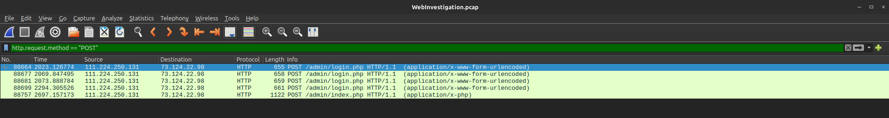

---

### 4.7 Credential Compromise

A POST request to the administrative panel was observed with the following credentials, resulting in a successful authentication response.

| Field      | Value        |
|------------|--------------|
| Username   | `admin`      |
| Password   | `admin123!`  |
| Response   | HTTP 302 (Redirect — login successful) |

**Evidence:**

> `11-found-userNpsswd-used.png` — POST request to /admin/ containing plaintext credentials captured in HTTP stream.

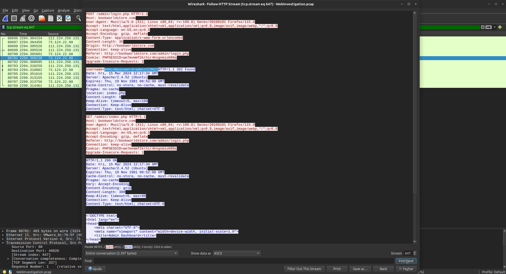

> `12-psswd-decoded.png` — Decoded/confirmed password value extracted from the captured request.

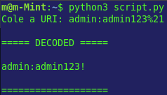

---

### 4.8 Web Shell Upload

After gaining administrative access, the attacker leveraged the panel's file upload functionality to deploy a PHP web shell on the server.

| Field           | Value                      |
|-----------------|----------------------------|
| Filename        | `NVri2vhp.php`             |
| Content-Type    | `application/x-php`        |
| Upload Vector   | Admin panel file upload     |
| Impact          | Remote Code Execution (RCE) |

**Evidence:**

> `13-found-attacker-upload.png` — HTTP POST request showing the multipart upload of NVri2vhp.php to the server.

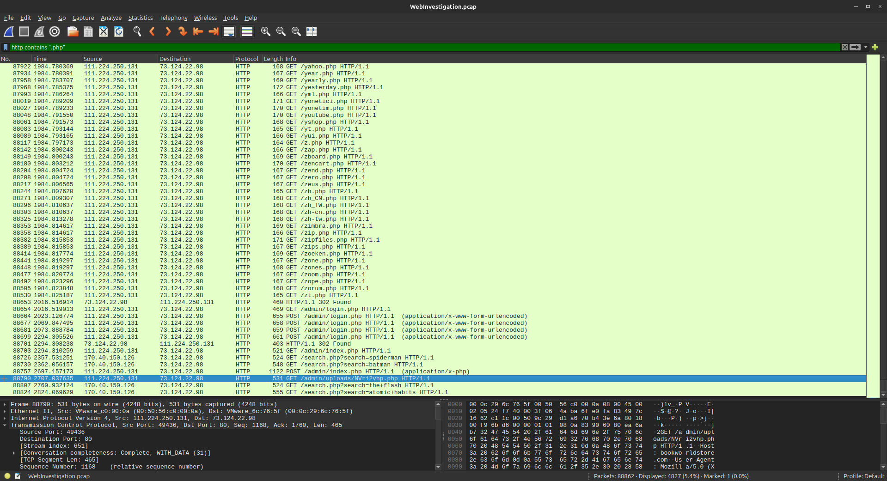

---

## 5. Indicators of Compromise (IOCs)

| Type            | Value                              | Context                          |
|-----------------|------------------------------------|----------------------------------|
| IP Address      | `111.224.250.131`                  | Attacker source IP               |
| URL             | `/search.php`                      | Vulnerable endpoint              |
| URL             | `/admin/`                          | Compromised admin panel          |
| Filename        | `NVri2vhp.php`                     | Deployed web shell               |
| Credential      | `admin` / `admin123!`              | Compromised admin credentials    |
| Content-Type    | `application/x-php`                | Web shell upload indicator       |
| SQL Pattern     | `UNION ALL SELECT ... INFORMATION_SCHEMA.SCHEMATA` | SQLi enumeration signature |

---

## 6. Impact Assessment

| Impact Area                | Severity | Description                                                              |
|----------------------------|----------|--------------------------------------------------------------------------|
| Data Confidentiality       | Critical | `customers` table exposed; potential exfiltration of PII                 |
| Data Integrity             | High     | Database records may have been modified                                  |
| System Availability        | High     | Web shell enables persistent access and potential disruption             |
| Remote Code Execution      | Critical | PHP web shell allows arbitrary OS command execution                      |
| Lateral Movement           | High     | Server access may enable pivoting to internal network resources           |
| Reputational Damage        | High     | Customer data breach carries legal and reputational risk                 |

---

## 7. Appendix — Decoder Script

A Python helper script was developed during the investigation to decode URL-encoded SQL payloads extracted from the PCAP, enabling human-readable analysis of obfuscated attack strings.

> See `7-decode-script-py.png` for the script as captured in the lab environment.

The script was used to process payloads captured in Wireshark HTTP streams, converting percent-encoded characters into plaintext SQL for analysis.

**Usage context:** Applied to payloads in findings **4.4** (Database Enumeration) and **4.5** (Table Enumeration).

---

## 8. Lessons Learned & Recommendations

### Vulnerability Root Causes

| Root Cause                        | Finding           |
|-----------------------------------|-------------------|
| Unsanitized user input in SQL query | SQL Injection in `search.php` |
| Weak administrative credentials   | `admin` / `admin123!` |
| Unrestricted file upload          | Web shell deployment via admin panel |
| Exposed admin panel               | `/admin/` accessible without rate limiting or MFA |

### Concepts

**1. SQL Injection — Immediate**
- Replace dynamic SQL queries with **parameterized queries / prepared statements**
- Apply strict input validation and allowlisting on the `search` parameter
- Deploy a **Web Application Firewall (WAF)** with SQLi rule sets

**2. Authentication Hardening**
- Enforce strong password policies on all administrative accounts
- Implement **Multi-Factor Authentication (MFA)** on `/admin/`
- Add rate limiting and lockout policies on login endpoints

**3. File Upload Controls**
- Restrict uploadable file types to an explicit allowlist (no `.php`, `.phtml`, etc.)
- Store uploaded files outside the web root
- Scan uploads with antivirus/antimalware before serving

**4. Monitoring & Detection**
- Configure SIEM rules to alert on `UNION SELECT`, `INFORMATION_SCHEMA`, and hex-encoded strings in HTTP parameters
- Monitor for anomalous POST requests to `/admin/` and unexpected file creation on the server
- Implement **File Integrity Monitoring (FIM)** on the web root

**5. Incident Response**
- Rotate all compromised credentials immediately
- Remove or quarantine `NVri2vhp.php` and audit server for additional web shells
- Perform a full database audit to assess the extent of data accessed or modified

---

*Report generated as part of Blue Team / DFIR lab exercise.*
*All findings are based on static PCAP analysis in a controlled lab environment.*
